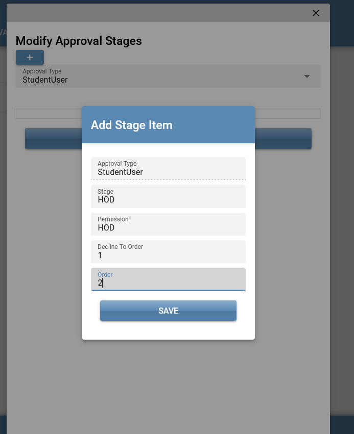

# Approval Engine

## Overview

This project is a web application that consists of a C# Web API, an MSSQL database, and a front-end application built using Quasar Framework.
It is set out to implement a "Dynamic" Approval Flow that can be easily pluged into any other project that requires some form of approval.
It is simple and dynamic as the levels of approvals can be modified and hence does not need to be hard coded. (nothing too complicated)

There are times when we need to implement some kind of approval flow in our project, we might even be required to have different approval flows in the same application.

This project implements an Approval flow can satisfy the basic approval flow need for any project.

## Table of Contents

- Installation
- Usage
- API Endpoints
- Database Schema
- Front-End
- License

## Installation

### Prerequisites

- .NET 6 SDK
- SQL Server
- Node.js (for Quasar)
- Quasar CLI

### Backend Setup

Clone the repository:

```bash
git clone https://github.com/kigold/ApprovalEngine.git
cd your-repo/src
```

Open ApprovalEngine.sln in visual studio and build the project

### Database Setup

In visual studio

- Update the database connectionStrings in this SampleAPp.Api -> appsettings.Development.json
  to your database connection string.

  ```
  "ConnectionStrings": {
  "DefaultConnection": "Server=your_server;Database=your_database;User Id=your_user;Password=your_password;"
  }
  ```

- Open package Manager Console, and select SampleApp.Core as the Default project
- then run the following commands

  ```
  Add-Migration init

  Updata database
  ```

### Frontend Setup

cd into /fe folder
and run the following commands

    ```
    npm install
    ```

## Structure

- SampleApp.API Layer (sample presentation layer)
- SampleApp.Core (sample logic and implementation)
- ApprovalEngine (Approval Engine Implementation)
- Unit Test
  It will have the main ApprovalEngine logic
  It will also have an API Layer as it will be a full fledge solution with a sample Entity that
  will be used to showcase the approval flow
  It will contain unit test for the approval Engine

### Usage

Open /src/ApprovalEngine.sln in visual studio, and set SampleApp.Api as the startup application, build and run.
This will start the web api on http://localhost:7287
You can view the swagger page on https://localhost:7287/swagger/index.html

Open /fe in your command line and run the command below

    ```
    quasar dev
    ```

This will start the frontend app on http://localhost:8080

From the Frontend application you should be able to login with the following seeded users

- admin@sample.com,
- it@sample.com,
- hod@sample.com,
  using password: "P@ssw0rd"
  these users have the following permissions respectively
- ADMIN
- IT
- HOD

You should be able to create a Student from the app, once this is done an approval request is added to the Approvals table,
each approval item has a Stage which shows the Permission required for the current level of approval, you can login in with the appropriate user and then attempt to approve.

When all the stages of approval has been completed, that status of the Student record will be updated to Approved.
This simulates the end of the approval process.

You can also modify the stages for the approval, by going to the Admin -> Stages.
NB you cannot modify the existing ApprovalType, rather this will create a new Version so that it will maintain the approval for existing items and will only affect new requests (Students request).

The approval Types (StudentUser, Teacher, AdminUser) is currently hardcoded for simplicity but it can be modified as the need rises.
For now we only have the Student entity which is linked to the StudentUser approval Type.
The seeded Approval levels for StudentUser is initially set to HOD -> ADMIN -> IT.
To simulate a change in the approval flow, go to the Admin -> Stages page and Create a new Approval Type, Select Student User, and then Add as many stages as you need



## Roadmap

- [x] Unit Test
- [x] Sample usage code
- [x] Authentication and Authorization
- [x] Front End Application (React or Vue)
- [] Drag and Drop approval

```

```
